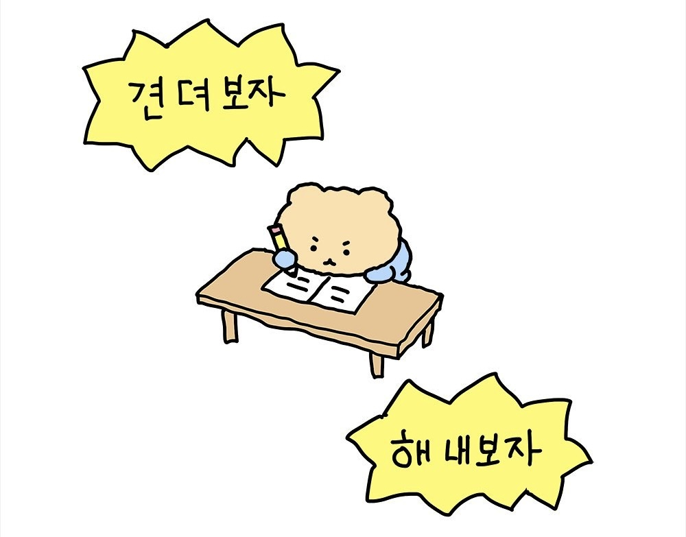

# ⭐ 임세하 (Seha Im)

- 🎂 1997.05.27
  
- 😀 MBTI | ISFP

- 🙃 TMI
  - 개발 초보
  - ❤️ Like
    - 집
    - 음악 감상, 유튜브 보기
    - Lauv, Post Malone
    - 회, 일식

  - 🚍 통학 시간 50분 ~ 1시간 20분
  
---

### 📚 School
  
- 전공
  - 건설시스템공학
  - 전자IT미디어공학 (복)

- 삼성 청년 SW 아카데미 (2024.01 ~ )

---

### 💻 Stacks

---

### ⏰ Goal

- 매일 배운 내용 복습
- 1학기 안에 SWEA A형 취득
- 구체적인 진로 정하기

### 💼 Work

- KIST Internship (2022.02 ~ 2022.09)
  - Quantum Center
  - HW engineer

- Tving (2023.10 ~ 2023.12)
  - Operation Support Team

---

### 📞 Contact
- phone | 010-3722-9138
- email | seha3722@gmail.com
